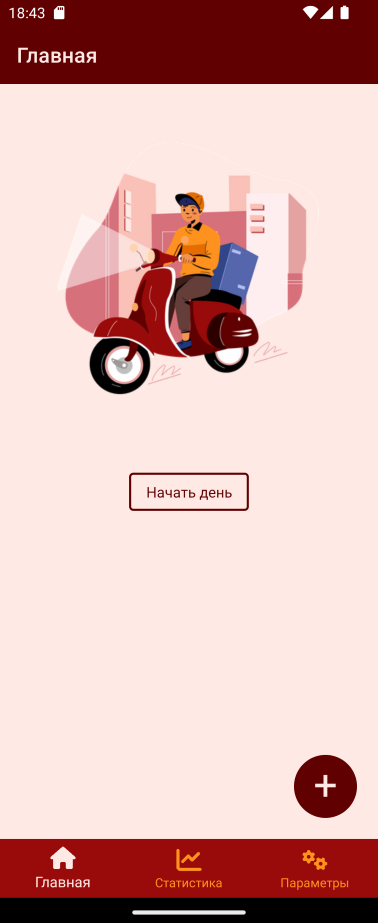
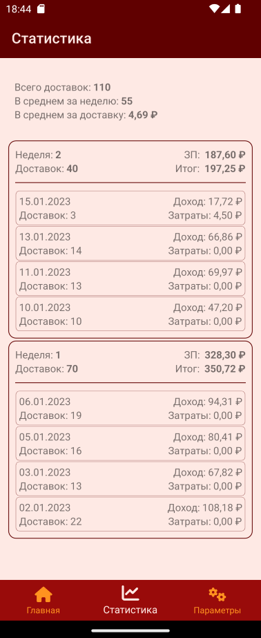

## MAUI программа учёта доставок для курьера
### или приложение выходного дня в поисках проблем MAUI

**Можно ли использовать `MAUI`?** Для прототипирования можно - очень быстрая разработка и после `WPF` или `UWP` порог вхождения максимально низкий. Кроссплатформенность! Я проверяю на `Windows 11` и `Android` (есть несколько разных устройств) 

Для прода нет. Ну, на текущий момент. Постоянно сталкиваешся с проблемами. Потом оказывается что проблема не в тебе, оказывается многие проблемы тихо висят на гите, многие давно. Очень давно.

Что не так на текущий момент (это всё касается `.NET 7`):

1. А на современных девайсах светлая-тёмная **<u>тема</u>** переключается автоматом. С восходом-заходом солнца. На `WinUI` да, всё работает. На `Android` нет. И нельзя отследить изменение системной темы. То есть события есть и все инструменты есть. Но они не работают. Самое интересное, что если не переопределять стили по умолчанию, то контролы подхватят изменения (я имею в виду, что шрифт, например, станет белым, и `Border` у `Entry` станет белым при тёмной системной теме), а вы нет. И отключение или переключение темы уже не поможет. Перезапускайте приложение. Сюрприз?

2. `HotReload` **<u>отвалится</u>**. Причём очень быстро. Сособенно если использовать наследование для контролов. А это очень болезненно с ростом приложния.

3. - `AppShell`. Нельзя использовать сместе `FlyoutMenu` и `TabbedPage`. Ну нельзя. Или-или.
Да, сложно представить себе приложение с большим и красивым выплывающим меню, а некоторые страницы выполнены в виде табов.
Кроме того, если использовать `AppShell` `TabBar` и один таб разбить на несколько табов, то `OnAppearing()` вызывается только для первого. И делай с этим что хочешь. Ишью висит со времён `Xamarin`. И это далеко не все проблемы. Это те, которые прилетели в лоб сразу.

   - От диалоговых окон (`DisplayAlert`, `DisplayPromptAsync` и т.д) лучше сразу отказаться и делать свой сервис.
 
   - А вообще, складывается впечатление, что для более-менее серъёзного приложения нужно отказываться от `AppShell` с его навигацией, диалогами и прочим. Иначе это выстрел в ногу. Хорошо, если рано. Но это же треть фреймворка и куча-куча времени.

4. **<u>Тени</u>** не работают. Ну как не работают. На одном устройстве работает, а на другом просто чёрное пятно под контролом, на третьем - огромное чёрное пятно. И это только с `Android`. Пока забил и не использую. 

5. `CollectionView` классная штука. Особенно если не трогать `VisualStates`. Особенно, если нужен единый вид на нескольких платформах. Только как его не трогать? А если `Hot Reload` уже отвалился...

6. Проблема с получением **<u>размеров</u>** контролов. Тут надо пояснить. Если это всё происходит на странице, то нет проблем. Но, допустим, у нас есть самостоятельный контрол на базе `Grid` у которого есть сервис и он сам получает необходимые данные и он не хочет (да и не должен) быть связан с другими контролами. И на основании этих данных нужно что-то изобразить (прогрессы, графики и т.д.). Так вот, размеры `Grid` мы не получим. Событий и методов внятных нет. Биндинг к `Grid` с конвертерами тоже ничего не даёт. Спасают костыли и анимации. А так бы хотелось бы события момента отрисовки, например.  А может я пока не нашёл решения)).

7. **<u>Документация</u>** `MAUI` пока слабая. Информации пока недостаточно даже для поверхностного изучения. Почти не документирован код.

8. **<u>Про перфоманс.</u>** Я никаких тестов и замеров не делал. Но на ещё не совсем старом телефоне с `2Gb` оперативки и не очень шустрым процом заметно, что тормозит очень сильно. Даже обсолютно пустое приложение. Там, где аналогичное и нативное (собранное в `Android Studio`) чувствует себя превосходно.

